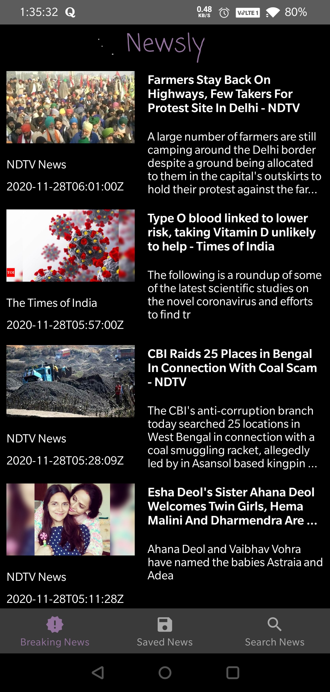
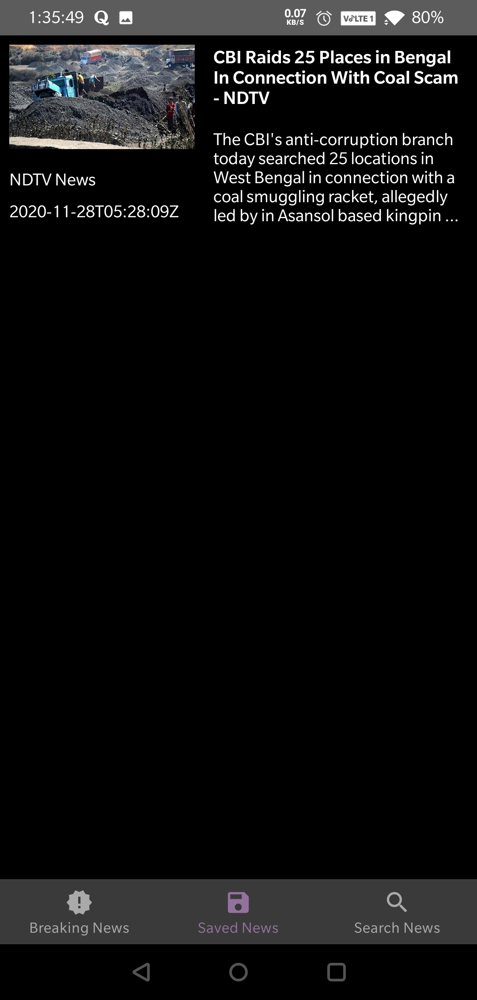
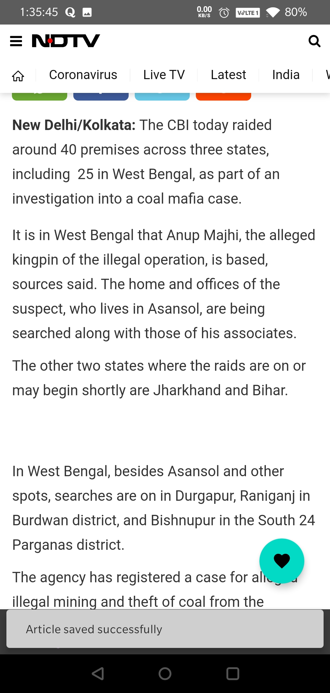

# Newsly - News Application
Newsly is a native android application which helps its users stay updated with all the current news in the country :fire:

## Key Features
1. See current news within the app only (no external browser needed)
2. Save your favourite news
3. Search for all news articles related to your entered keyword

## App Screenshots

